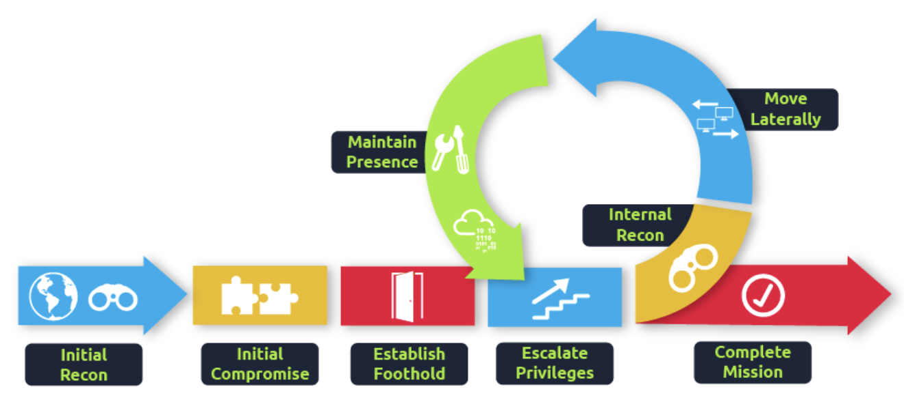
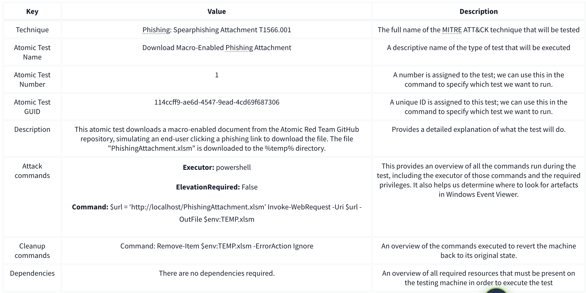

# Atomic Red Team
### Detection Gaps
- Study novel techniques and update our signature and alert rules to detect 
- The line between anomalous and expected behaviour is often very fine and sometimes even has significant overlap. For example, let's say we are a company based in the US. We expect to see almost all of our logins come from IP addresses in the US. One day, we get a login event from an IP in the EU, which would be an anomaly. However, it could also be our CEO travelling for business. This is an example where normal and malicious behaviour intertwine, making it hard to create accurate detection rules that would not have too much noise.

### Cyber Attacks and the Kill Chain

Unified Cyber Kill chain:



It would be our dream to prevent all attacks at the start of the kill chain. So even just when threat actors start their reconnaissance, we already stop them dead in their tracks. But, as discussed before, this is not possible. The goal then shifts slightly. If we are unable to fully detect and prevent a threat actor at any one phase in the kill chain, the goal becomes to perform detections across the entire kill chain in such a way that even if there are detection gaps in a single phase, the gap is covered in a later phase. The goal is, therefore, to ensure we can detect the threat actor before the very last phase of goal execution.

### MITRE ATT&CK
- A popular framework for understanding the different techniques and tactics that threat actors perform through the kill chain
- The framework is a collection of tactics, techniques, and procedures that have been seen to be implemented by real threat actors. 
- The framework provides a navigator tool where these TTPs can be investigated

### Atomic Red 
- Collection of red team cases that are mapped to the MITRE ATT&CK framework
- Supports automation, where the technique can be automatically executed 

### Droping the Atomic

### Running the Atomic
- Help page ```Get-Help Invoke-Atomictest```

| Parameter          | Explanation                                                                                       | Example use                                                                                   |
|--------------------|---------------------------------------------------------------------------------------------------|-----------------------------------------------------------------------------------------------|
| `-AtomicTechnique` | This defines what technique you want to emulate. You can use the complete technique name or the "TXXXX" value. This flag can be omitted. | `Invoke-AtomicTest -AtomicTechnique T1566.001`                                               |
| `-ShowDetails`     | Shows the details of each test included in the Atomic.                                            | `Invoke-AtomicTest T1566.001 -ShowDetails`                                                   |
| `-ShowDetailsBrief`| Shows the title of each test included in the Atomic.                                              | `Invoke-AtomicTest T1566.001 -ShowDetailsBrief`                                              |
| `-CheckPrereqs`    | Provides a check if all necessary components are present for testing.                             | `Invoke-AtomicTest T1566.001 -CheckPrereqs`                                                  |
| `-TestNames`       | Sets the tests you want to execute using the complete Atomic Test Name.                           | `Invoke-AtomicTest T1566.001 -TestNames "Download Macro-Enabled Phishing Attachment"`         |
| `-TestGuids`       | Sets the tests you want to execute using the unique test identifier.                              | `Invoke-AtomicTest T1566.001 -TestGuids 114ccff9-ae6d-4547-9ead-4cd69f687306`                |
| `-TestNumbers`     | Sets the tests you want to execute using the test number. The scope is limited to the Atomic Technique. | `Invoke-AtomicTest T1566.001 -TestNumbers 2,3`                                               |
| `-Cleanup`         | Run the cleanup commands that were configured to revert your machine state to normal.             | `Invoke-AtomicTest T1566.001 -TestNumbers 2 --Cleanup`                                       |

- Type of information is provided in a test



- Before running the emulation, we should ensure that all required resources are in place to conduct it successfully. To verify this, we can add the flag ```-Checkprereq``` to our command. The command should look something like this: ```Invoke-AtomicTest T1566.001 -TestNumbers 1 -CheckPrereq```.